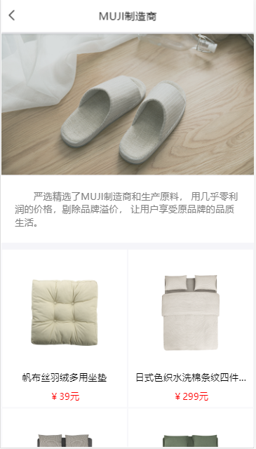
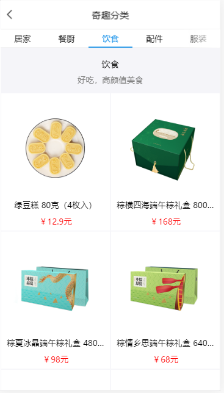
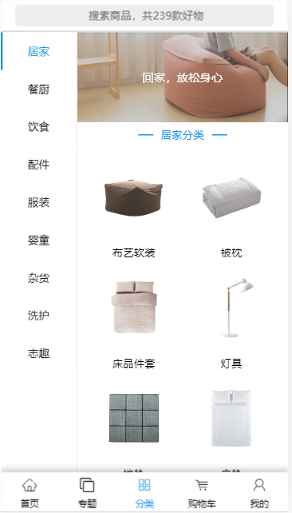
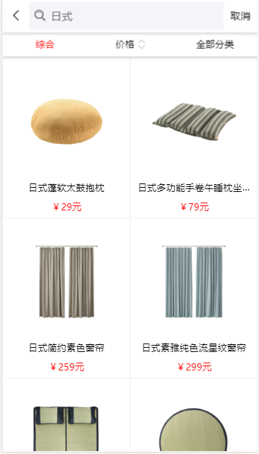
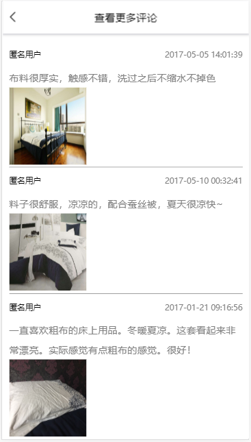
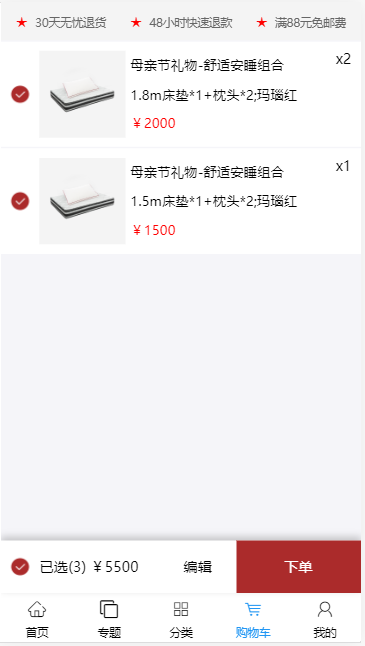
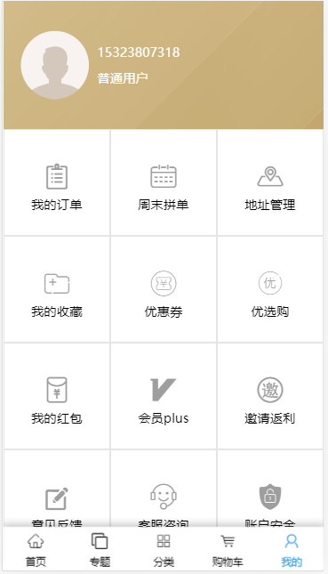
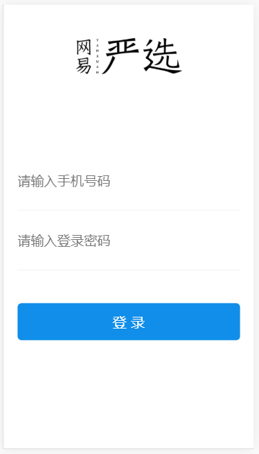

# EasyMarket [易购](https://github.com/Peroluo/easyMarket) 

> ​	EasyMarket是仿网易严选UI设计的H5 webApp。项目是基于React+Redux+Redux-saga+Axios+React-router架构完成！
>
> ​	EasyMarket采用模块化、组件化的设计方式，实现页面、组件、Api、路由模块化。
>
> ​	EasyMarket采用阿里antd-design-mobile的UI组件。

## EasyMarket  扫码预览

> 登录号码： 15323807318或15818264086
>
> 登录密码： 123456

<figure >

</figure >

## EasyMarket Screenshotss

|         首页         |        制造商         |         商品分类         |
| :------------------: | :-------------------: | :----------------------: |
|  |  |  |

|         专题          |          专题详情           |            分类检索            |
| :-------------------: | :-------------------------: | :----------------------------: |
|  |  |  |

|          商品查询           |          商品详情           |        更多评论         |
| :-------------------------: | :-------------------------: | :---------------------: |
|  |  |  |

|        购物车        |         我的         |         登录          |
| :------------------: | :------------------: | :-------------------: |
|  |  |  |

## EasyMarket Preview

<figure class="third">
    
</figure>

## EasyMarket Tips

>* EasyMarket 正在更新维护状态，部分功能尚未没完成。
>* 倘若您发现Bug或者有优化意见及其他宝贵意见，欢迎您提交issue或者联系我 qq = 1025558554 、Email = 1025558554@qq.com
>* 本项目API接口来自[NideShop](https://github.com/tumobi/nideshop-mini-program/)，在此感谢NideShop作者。
>* API接口我会在NideShop 服务端的基础上，进行完善。

## EasyMarket 未完成功能

> * 支付订单、订单查询、优惠券、收藏商品、地址管理...未来会不断完善！

##  End

> * 此项目对您有帮助，帮忙点个Start吧!
> * 作者还会不断更新， 您的支持是作者不断更新的动力!
> * Thanks!

## About Me

> Name: pero 罗
>
> QQ: 1025558554
>
> Email：1025558554@qq.com
