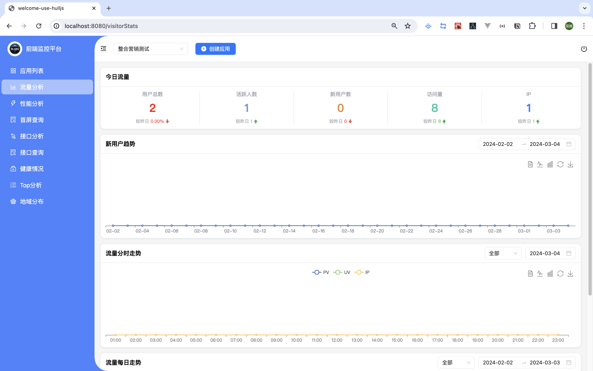
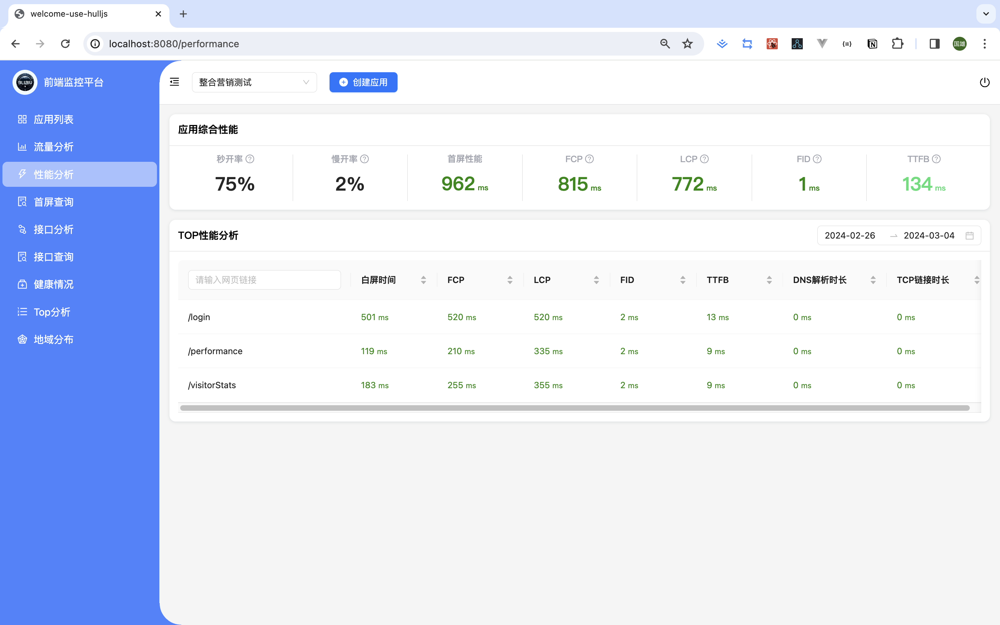
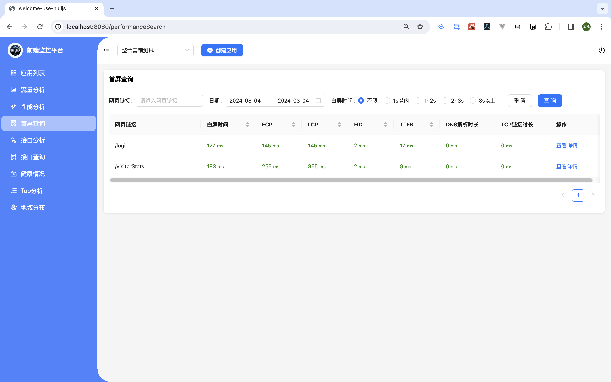
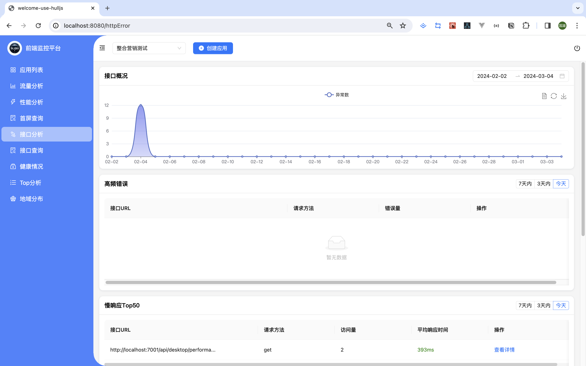
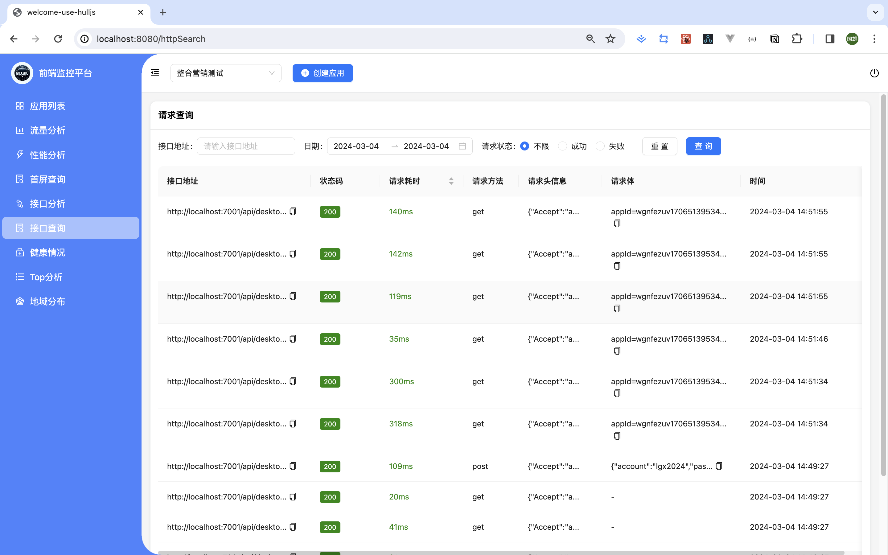
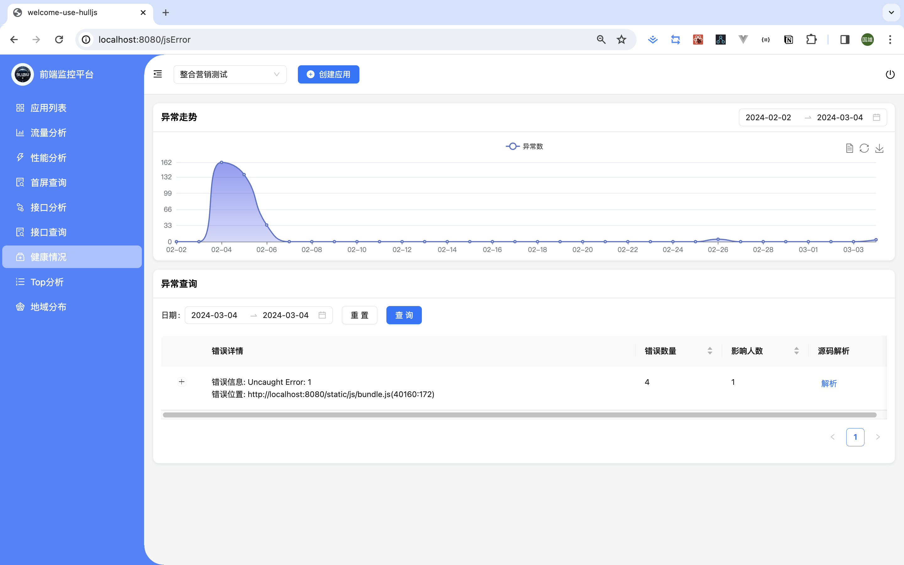
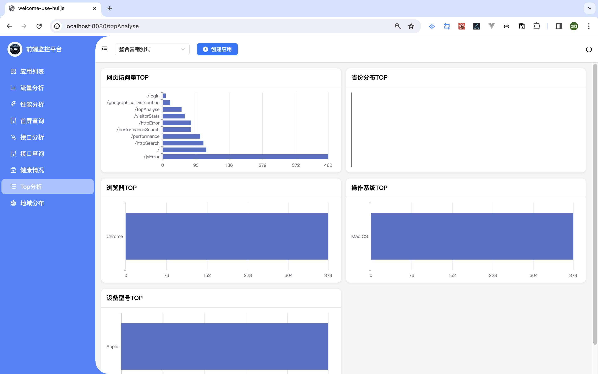
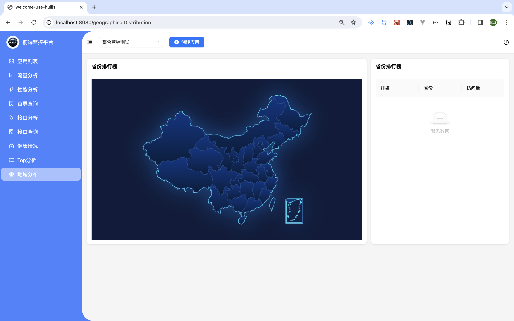
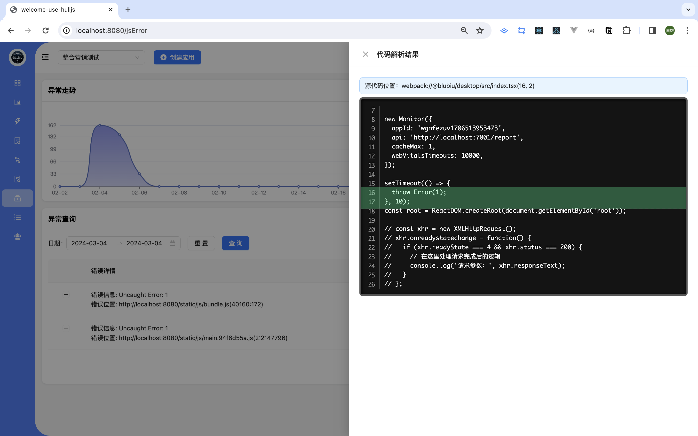

# frontend-watch-dog

## 快速开始

1. 安装Docker 官网：https://www.docker.com/

2. 安装docker-compose 下载地址：https://github.com/docker/compose/releases

3. 进入到service目录，修改hostIP

```shell
# 改成你的本地IP地址
export hostIP='192.168.104.105'
```
4. 进入到service目录,执行安装docker基础服务
```shell
./start-docker-compose.sh
```
5. 安装依赖
```shell
yarn install

yarn dev
```

## 目录说明
```shell
|-- desktop                                                          // 监控后台系统
|-- packages                                                         // 上报SDK
|   |-- web-sdk
|-- service                                                          // 监控服务端
```

### 实现功能

- [x] 流量分析（UV、PV、IP分析模型）
  - [x] 新用户趋势
  - [x] 今日流量
  - [x] 分时流量
  - [x] 每日流量
- [x] 性能分析
  - [x] 综合应用性能（网页平均性能）
  - [x] Top性能分析

- [x] 首屏查询

- [x] 接口分析
  - [x] 接口异常每日走势
  - [x] 高频错误
  - [x] 慢响应Top50
- [x] 接口查询
- [x] 监控概况（JS异常分析）
  - [x] js异常数每日走势
  - [x] 日常查询
  - [x] 错误源码定位
- [x] Top分析
  - [x] 网页访问量Top
  - [x] 省份分布Top
  - [x] 浏览器Top
  - [x] 操作系统Top
  - [x] 设备型号
- [x] 地域分布
- [ ] 用户轨迹分析
- [ ] 架构升级

















