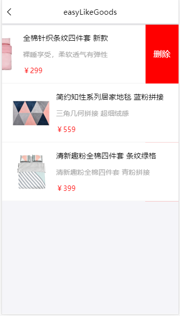

# EasyMarket [易购](https://github.com/Peroluo/easyMarketApp) 

> ​EasyMarket是仿网易严选UI设计的H5 webApp。项目是基于React+Redux+Redux-saga+Axios+React-router。
> ​EasyMarket采用阿里antd-design-mobile的UI组件。

## EasyMarket  扫码预览

#### 微信浏览器，请点击"访问原网页"

<figure >

</figure >

## EasyMarket Screenshots

|         首页         |        制造商         |         商品分类         |         收藏商品         |
| :------------------: | :-------------------: | :----------------------: | :----------------------: |
|  |  |  |  |

|         专题          |          专题详情           |            分类检索            |          商品查询           |
| :-------------------: | :-------------------------: | :----------------------------: | :-------------------------: |
|  |  |  |  |

|        购物车        |          商品详情           |        更多评论         |         我的         |
| :------------------: | :-------------------------: | :---------------------: | :------------------: |
|  |  |  |  |

## EasyMarket Preview

<figure class="third">
    
</figure>

## EasyMarket Tips

>* EasyMarket 正在更新维护状态，部分功能尚未没完成。
>* 倘若您发现Bug或者有优化意见及其他宝贵意见，欢迎您提交issue或者联系我 qq = 1025558554 、Email = 1025558554@qq.com
>* EasyMarket 服务端 ，请移步至 [EasyMarketSever](https://github.com/Peroluo/easyMarketSever)。

## EasyMrket 本地部署

> 1. git  clone https://github.com/Peroluo/easyMarketApp.git
> 2. 安装依赖 cnpm install
> 3. 修改package.json文件中proxy字段的值 = 你本地服务器的ip地址 （"proxy": "http://127.0.0.1:8888"）
> 4. 如果老铁不会在本地部署服务端，可以将第三步的ip地址，改成我部署的服务ip地址（"proxy": "http://202.96.155.121:8888"）,我部署的服务比较低级，避免挂掉，各位老铁，还是在你本地部署个吧~
> 5. npm start
> 6. 部署到服务端 npm run build ,将build文件夹中的文件放到 [EasyMarketSever](https://github.com/Peroluo/easyMarketSever) 的www/web/easyMarket目录中

## EasyMarket 未完成功能

> * 支付订单、订单查询、优惠券、地址管理...未来会不断完善！

##  End

> * 喜欢 EasyMarket，帮忙点个Star吧!
> * 作者还会不断更新， 您的支持是作者不断更新的动力!
> * Thanks!

## About Me

> Name: pero 罗
>
> QQ: 1025558554
>
> Email：1025558554@qq.com
